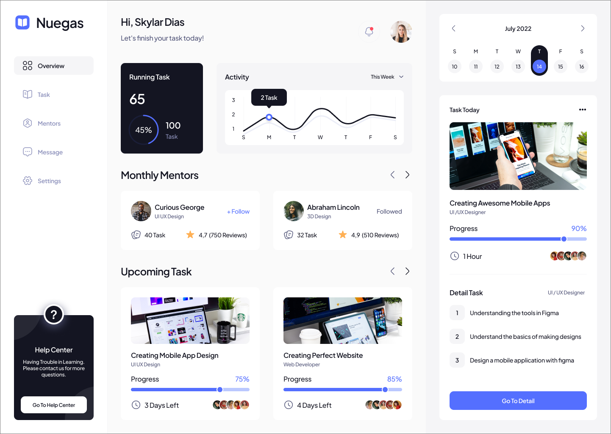

# CodTech - Task 2

- **Name:** Dharshini N
- **Company:** CodTech IT Solutions
- **ID:** CT08DS3884
- **Domain:** UI/UX Design
- **Duration:** July 5th, 2024 to August 5th, 2024
- **Mentor:** Neela Santhosh kumar

## Project Overview: Analytics Dashboard Design

Designing a dashboard interface for an analytics platform involves understanding user requirements, planning the layout, selecting appropriate data visualizations, implementing interactive elements, and refining the design based on feedback. Using tools like Figma, Sketch, or Adobe XD can help create an effective and visually appealing dashboard that clearly presents complex data and key performance metrics.

### Objectives

- Create a dashboard interface that visualizes data insights and key performance metrics.
- Ensure the presentation of complex data is clear and understandable.
- Incorporate data visualization techniques and interactive elements to enhance user exploration.

## Example Screens:

